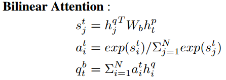
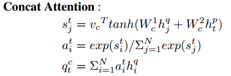
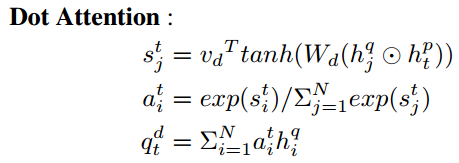
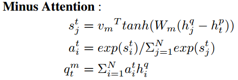
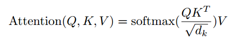
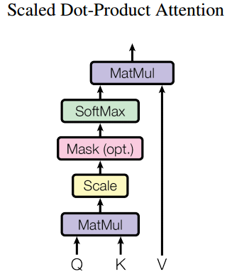
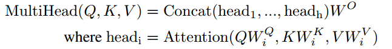
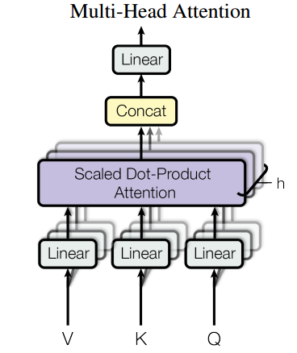

<!-- TOC -->

- [1. PAPER LEARNING](#1-paper-learning)
  - [1.1. NLP Trends](#11-nlp-trends)
  - [1.2. Sequence Encoder](#12-sequence-encoder)
  - [1.3. Graph Network](#13-graph-network)
  - [1.4. Graph Embedding](#14-graph-embedding)
  - [1.5. Attention](#15-attention)
  - [1.6. CTR](#16-ctr)

<!-- /TOC -->

# 1. PAPER LEARNING

## 1.1. NLP Trends

- ELMO
- GPT
- BERT

## 1.2. Sequence Encoder

- TCNN
- Transformer

## 1.3. Graph Network

- GCN

## 1.4. Graph Embedding

- Node2vec/DeepWalk

## 1.5. Attention

- 乘性注意力

- 加性注意力

- 点乘注意力

- 减法注意力

- 自注意力(**attention is all you need**)
    - single-head attention
    

    

    - multi-head attention
    

    

- 比较  
《atention is all you need》里面提出的attention一统了注意力机制的框架。之前的注意力都可以用（Q，K，V）这一套来进行表示。并且multi-head attention进一步提升了模型的表达能力。  
> 在下面我们将针对文本分类任务来对这些attention机制的性能进行比较。具体见

## 1.6. CTR

- DeepFM
- DIN

### New Papers
- Auto Cross
- 

***
Author:Lym  
Email:2268435391@qq.com  
**Keep Carry and Going On!**
